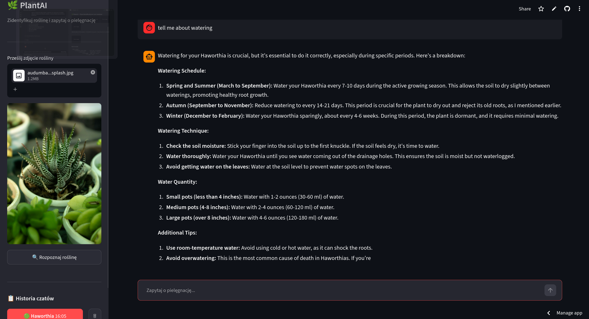

# 🌿 PlantAI — Plant Identification & Care Assistant


---



---

## How it works

```
Photo upload
    └─► BioCLIP vision model       (zero-shot, 58 species)
            └─► Web search          (DuckDuckGo / Tavily)
                    └─► ChromaDB    (RAG vector store)
                            └─► Llama 3 chat
```

A **LangGraph ReAct agent** orchestrates the identification pipeline autonomously — it decides when to call the vision model, when to fetch web articles, and when to answer. No hardcoded flow.

---

## Stack

| Layer | Tech |
|---|---|
| Vision | [BioCLIP](https://huggingface.co/imageomics/bioclip) — trained on 10M biological specimens |
| LLM | Llama 3.3 70B (agent) · Llama 3.1 8B (chat) via Groq |
| RAG | ChromaDB · `all-MiniLM-L6-v2` embeddings · LangChain |
| Agent | LangGraph ReAct with 3 tools |
| UI | Streamlit — sidebar upload, chat interface, session history |

---

## Quickstart

```bash
git clone https://github.com/your-username/plantai
cd plantai
pip install -r requirements.txt
```

Add your API keys to `.streamlit/secrets.toml`:
```toml
GROQ_API_KEY = "..."
TAVILY_API_KEY = ""   # optional — DuckDuckGo works without it
```

```bash
streamlit run app.py
```

> **Free to run.** BioCLIP and embeddings run locally. Groq free tier covers 14 400 requests/day.

---

## Features

- 🔍 **Zero-shot plant recognition** — no training data needed, ensemble of 3 prompt formats
- 🤖 **Autonomous agent** — identifies species, fetches care articles, builds knowledge base
- 💬 **RAG-powered chat** — answers grounded in real web sources, not hallucinated
- 📋 **Session history** — switch between multiple identified plants mid-conversation
